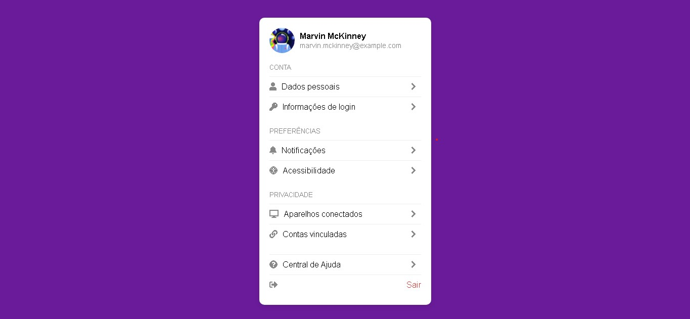

# Profile Settings Page

Uma página de **Configurações de Perfil** feita com HTML e CSS. Este projeto foi desenvolvido para fornecer uma interface intuitiva, limpa e funcional para a atualização de informações de perfil do usuário.

## 🔗 Preview
Veja o preview do projeto em funcionamento [aqui](https://tiagoalves1212.github.io/profile-settings/).



## 🖥️ Tecnologias Utilizadas
- **HTML5**: Estrutura do conteúdo da página.
- **CSS3**: Estilos e layout, incluindo propriedades para responsividade e personalização.

## ✨ Recursos
- **Campos de Formulário Personalizados**: Cada campo é estilizado para uma experiência de usuário agradável.
- **Botão de Upload de Imagem**: Inclui um botão estilizado para upload de uma nova imagem de perfil.
- **Layout Responsivo**: A página foi otimizada para se ajustar a diferentes tamanhos de tela.
- **Design Moderno**: Interface clara, com ênfase em usabilidade.

## 📂 Estrutura do Projeto
- `index.html`: Arquivo principal contendo o código HTML da página.
- `styles.css`: Arquivo de estilos CSS que define o layout e o design visual.
- `assets/`: Pasta com imagens e outros recursos estáticos.

## 🚀 Como Usar
1. **Clone o repositório**: 
   ```bash
   git clone https://github.com/seu-usuario/profile-settings-page.git
